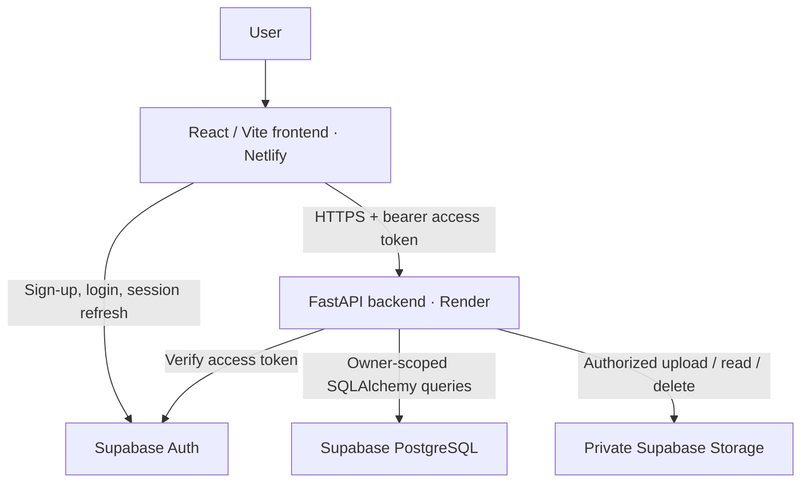

# Smart Wardrobe

A full-stack smart wardrobe application that allows users to manage their personal clothing collection and generate context-aware outfit recommendations.

[](https://github.com/AliKaganAlbayrak/smart-wardrobe/actions/workflows/ci.yml)


## Project Overview

Smart Wardrobe combines a responsive clothing dashboard with a deterministic,
explainable recommendation engine. Each account has a private collection:
clothing, photos and recommendations are scoped to the authenticated user.

The modular backend uses FastAPI and SQLAlchemy. Production records and images
live in Supabase PostgreSQL and private Storage, independently of the backend's
ephemeral filesystem. No ML model or weather service is required.

## Live Demo

- **Application:** [Smart Wardrobe on Netlify](https://wonderful-quokka-3c636d.netlify.app)
- **API documentation:** [Interactive Swagger UI](https://smart-wardrobe-api-xskr.onrender.com/docs)
- **Backend health:** [FastAPI root endpoint](https://smart-wardrobe-api-xskr.onrender.com/)
- **Source:** [AliKaganAlbayrak/smart-wardrobe](https://github.com/AliKaganAlbayrak/smart-wardrobe)

Register with your own email address and confirm it before signing in.
A new account starts with an empty wardrobe; there is no shared demo account.
The Render free instance may take a short time to wake after inactivity.

## Key Features

- Registration, email confirmation, login/logout and persistent, refreshed sessions.
- Private wardrobes with photo upload, listing, viewing, partial editing and deletion.
- Clothing metadata: category, color, style, fit, material, formality and multiple seasons.
- Category, color and season API filters; additional style filtering in the frontend.
- Rule-based outfit ranking with color, season, style and formality compatibility.
- Explainable scores, reasons and penalties; optional autumn/winter jackets.
- Responsive cards, image previews, edit dialogs, confirmation, loading/error/retry feedback.
- Persistent PostgreSQL records and private images across backend redeploys.

## Multi-user Architecture

Each clothing row has an indexed UUID `owner_id`. New ownership comes exclusively
from the server-verified current user, never from a submitted `user_id` or `owner_id`.

CRUD, PATCH, filtered lists, recommendations and image downloads enforce ownership.
Legacy rows without an owner are preserved but hidden; they are not automatically
assigned to the next person who signs in. The application does not expose a
client-side administrative data API.

## Authentication & Authorization

The frontend uses Supabase Auth for email/password accounts, persistent sessions,
PKCE email-confirmation handling and automatic access-token refresh.
A centralized API client attaches the current bearer token and handles expiration.

FastAPI verifies each access token with the configured Supabase project's
`/auth/v1/user` endpoint. It does not trust locally decoded JWT claims.
Missing, invalid or expired tokens return **401**; a foreign owner's clothing ID
returns **403**; missing or unowned legacy records return **404**.
Root and Swagger are public; clothing and recommendation routes require a user token.

## Outfit Recommendation Engine

The engine creates the Cartesian product of eligible **top + bottom + shoes**,
scores each outfit, and returns the highest-ranked results with deterministic ID
tie-breaking. It operates on supplied clothing objects, without database access.

- Tops: `tshirt`, `shirt`, `polo`, `sweater`, `hoodie`.
- Bottoms: `pants`, `jeans`, `shorts`; footwear: `shoes`.
- Outer layer: one compatible `jacket` or `coat`, only for autumn/winter.

| Component | Weight | Evaluation |
| --- | --- | --- |
| Color | 35% | Normalized Turkish/English names, neutral, monochrome, earth-tone and explicit pair rules |
| Season | 25% | Multiple seasons, `all-season` and legacy `season` fallback |
| Style | 25% | Compatibility between casual, smart casual, formal and sport |
| Formality | 15% | Distance between 1–10 formality values |

Color, style and formality average the three core pair scores. Season averages the
three pieces: an exact match scores 1.0, all-season suitability 0.85 and a mismatch
0.10. Unknown color/style or missing formality receives a neutral 0.5 fallback,
not a perfect score. Fit and material are displayed but do not affect ranking.

```text
weighted = color × 0.35 + season × 0.25 + style × 0.25 + formality × 0.15
quality_factor = season_score if a season is requested and season_score < 0.80 else 1
total_score = clamp((weighted + jacket_bonus) × quality_factor, 0, 1)
```

A suitable jacket adds a compatibility-scaled bonus of up to 0.05. It cannot
compensate for an unsuitable core outfit. Each result retains its clothing objects
and `score`; `details` includes component scores, `total_score`, `reasons`,
`penalties`, `jacket_bonus` and `season_quality_factor`.
An incomplete wardrobe returns an empty result and a helpful message, not a server error.

## Image Storage

Multipart uploads use UUID filenames and preserve the supplied extension.
Production objects are stored in the private `clothing-images` bucket as:

```text
<owner UUID>/<image UUID>.<extension>
```

The database stores the durable object key. API `image_path` is an authenticated
route such as `clothes/123/image`, not a public or expiring image URL.
The backend checks ownership before downloading or deleting an object. The React
client requests the image with a token and renders a temporary Blob URL.

Local development uses `uploads/<owner UUID>/<image UUID>.<extension>`.
Neither local uploads nor the SQLite database belongs in Git.

## Tech Stack

| Layer | Technologies |
| --- | --- |
| Backend | Python 3.13, FastAPI, Pydantic, SQLAlchemy 2, Uvicorn |
| Persistence | PostgreSQL + psycopg in production; SQLite locally |
| Identity & images | Supabase Auth, private Supabase Storage, server-side HTTPX adapters |
| Frontend | React 19, TypeScript 5.9, Vite 7, Supabase JS, plain CSS |
| Tests | Python unittest, FastAPI TestClient, Node's built-in test runner |
| Delivery | GitHub Actions, Render backend, Netlify frontend |

## Architecture



Routers define HTTP contracts, schemas validate responses and updates, and services
handle clothing operations, storage and recommendation scoring.

## Project Structure

```text
app/
  main.py                   FastAPI app, routers, CORS and private response headers
  auth.py                   Supabase token verification and current-user dependency
  config.py, database.py     Environment configuration, engine and sessions
  models.py, schemas.py      ORM model and Pydantic contracts
  migrate.py                Bounded schema preflight and additive migrations
  database_diagnostics.py   Credential-safe database diagnostics
  routers/                  Clothing and recommendation endpoints
  services/                 Clothing, image storage and recommendation logic
frontend/
  src/components/           Reusable UI, private images and auth gate
  src/pages/                Auth, wardrobe, add clothing and recommendations
  src/services/             Auth/session store, API client and presentation helpers
  src/types/, src/styles/   Shared types and responsive CSS
  tests/, scripts/          Service/auth tests and production config validation
tests/                      Isolated backend and security tests
docs/                       Deployment, authentication and screenshot documentation
.github/workflows/ci.yml     Automated project checks
render.yaml, netlify.toml    Hosting configuration
```

## API Overview

| Method | Endpoint | Purpose |
| --- | --- | --- |
| GET | `/` | Public process-health response |
| GET | `/docs` | Public interactive API documentation |
| GET | `/clothes` | Own wardrobe; optional category, color and season filters |
| POST | `/clothes` | Multipart clothing creation and optional image upload |
| GET | `/clothes/{clothing_id}` | Own clothing details |
| PATCH | `/clothes/{clothing_id}` | Partial JSON metadata update; preserves image |
| DELETE | `/clothes/{clothing_id}` | Delete own record and associated image |
| GET | `/clothes/{clothing_id}/image` | Authenticated, owner-authorized image response |
| GET | `/recommendations` | Own outfits; optional season and limit (default 3, range 1–20) |

POST accepts `name`, `category`, `color`, `season`/`seasons`, `style`,
`fit`, `material`, `formality` and `image`. Repeat multipart `seasons`
fields for multiple values. Responses return `seasons` as a JSON array and allow
nullable legacy metadata. Formality outside 1–10 returns **422**.

List/create responses use `{ "clothes": [...] }` and
`{ "message": "...", "clothing": {...} }`. PATCH returns the clothing object:

```json
{"style": "smart_casual", "formality": 6, "seasons": ["spring", "summer"]}
```

Recommendations: `GET /recommendations?season=winter&limit=3`.
Use Swagger's **Authorize** control with your own access token for protected routes.

## Local Development

Prerequisites: Python 3.13, Node.js 24, pnpm 11.19 and a Supabase project for Auth.
Production credentials are not needed to run the automated tests.

**Backend (Windows PowerShell):**

```powershell
python -m venv .venv
.\.venv\Scripts\python.exe -m pip install -r requirements-dev.txt
.\.venv\Scripts\python.exe -m uvicorn app.main:app --reload --port 8001
```

Export your own backend environment settings before starting the server.
The backend does **not** automatically load `.env` files. SQLite and local images
are the development defaults, but login still requires `SUPABASE_URL` and the
server-only `SUPABASE_SECRET_KEY`. There is no authentication bypass.
An existing virtual environment can be used directly without activating it.

**Frontend (separate terminal):**

```sh
cd frontend
# Copy .env.example to .env.local and configure your own public Auth settings.
pnpm install --frozen-lockfile
pnpm dev
```

The committed pnpm lockfile provides reproducible frontend installation.
`npm install` / `npm run dev` are also supported if npm is preferred.

Frontend: [127.0.0.1:5173](http://127.0.0.1:5173).
Backend: [127.0.0.1:8001](http://127.0.0.1:8001).
Configure the frontend origin and confirmation redirect URL in Supabase Auth.
See [authentication setup](docs/authentication.md) for the complete account flow.

## Environment Variables

Safe templates: [backend .env.example](.env.example) and
[frontend .env.example](frontend/.env.example). Never commit populated environment files.

| Backend variable | Purpose |
| --- | --- |
| `APP_ENV` | `development` locally; `production` on Render |
| `DATABASE_URL` | Production PostgreSQL URI; secret. Empty uses SQLite only in development |
| `IMAGE_STORAGE` | `local` for development; `supabase` in production |
| `SUPABASE_URL` | Supabase HTTPS project origin |
| `SUPABASE_SECRET_KEY` | Server-only secret key; never a frontend variable |
| `SUPABASE_STORAGE_BUCKET` | Private bucket name, default `clothing-images` |
| `FRONTEND_ORIGINS` | Comma-separated exact frontend origins for CORS |
| `WARDROBE_DATA_DIR` | Optional local SQLite/uploads directory |

The legacy `SUPABASE_SERVICE_ROLE_KEY` is an alternative when
`SUPABASE_SECRET_KEY` is unset. Use the Supabase **Session pooler** URI on port 5432
with `sslmode=require`; percent-encode reserved characters in its password.

| Frontend build-time variable | Purpose |
| --- | --- |
| `VITE_API_BASE_URL` | Backend origin, without `/docs` or another path |
| `VITE_SUPABASE_URL` | Supabase HTTPS project origin |
| `VITE_SUPABASE_PUBLISHABLE_KEY` | Public publishable key; never a secret/service-role key |

Changing a `VITE_*` value requires rebuilding the frontend.

## Testing

From the project root:

```powershell
.\.venv\Scripts\python.exe -m tests
```

The isolated runner clears persistence credentials and uses temporary SQLite/files.
Tests cover real FastAPI routes, CRUD/PATCH, serialization, migrations, PostgreSQL
configuration, Auth/Storage adapters, two-user isolation and safe failure handling.
Supabase HTTP is mocked; local tests do not claim to validate a live cloud database.

```sh
cd frontend
pnpm test
pnpm exec tsc -b
pnpm build
```

Frontend tests cover API services, multipart uploads, optional jackets, Auth UI,
registration, login/logout, refresh, 401 handling and account-switch races.

GitHub Actions runs these checks on pushes and pull requests with read-only
repository permissions and no production secrets. Its build uses inert public
placeholders and is not a deployment. Live isolation and persistence across Render
redeploys have also been verified separately with disposable accounts and images.

## Deployment

- **Render:** `render.yaml` defines the backend build, explicit migration/start
  sequence and root health check.
- **Netlify:** `netlify.toml` builds from `frontend/`, publishes `dist/`, validates
  public production settings and rewrites SPA routes to `index.html`.
- **Supabase:** PostgreSQL, Auth and a private `clothing-images` bucket.

Backend start command:

```sh
python -m app.migrate && python -m uvicorn app.main:app --host 0.0.0.0 --port $PORT --workers 1
```

Missing production database/storage/privacy settings fail startup; there is no
fallback to ephemeral SQLite or local uploads. The bounded database preflight and
additive migration preserve existing rows. PostgreSQL and Storage survive backend
redeploys; backups and service availability still require operational care.

For a new deployment, follow [deployment configuration](docs/deployment.md) and
[Auth/private storage setup](docs/authentication.md). Existing production users
and local legacy data are not reset or automatically imported.

## Security

- Backend access-token verification and server-side ownership enforcement protect
  every clothing, recommendation and private-image operation.
- Users cannot read, edit or delete another user's wardrobe through these routes.
- UUID owner-scoped storage paths and a private bucket prevent public image access.
- Restrictive RLS guards provide an additional client-side access boundary;
  trusted backend database/storage credentials can bypass RLS, so API authorization
  remains mandatory.
- Secret/service-role keys and database credentials stay on the backend in environment
  variables. Only the publishable Auth key is bundled into the frontend.
- Protected responses use `Cache-Control: private, no-store`.
  Exact-origin CORS complements, but does not replace, authentication.
- Credential-safe connection diagnostics avoid exposing DSNs, passwords and tokens.

This portfolio application is not an independent security audit. Upload
content/size hardening, rate limiting, monitoring and recovery procedures remain
important production improvements.

## Screenshots

Production screenshots will be added here.

Assets will be placed in [docs/screenshots/](docs/screenshots/README.md).
Historical local screenshots are retained there but are not presented as final
production screenshots.

## Future Improvements

- Stronger upload content/size validation and account-data deletion workflows.
- Pagination and more scalable outfit ranking for larger wardrobes.
- Recommendation diversity and more detailed per-piece explanations.
- Repeatable browser/accessibility tests and automated live persistence QA.
- Versioned migrations, database/image backups and storage reconciliation.
- Rate limiting and operational monitoring.
