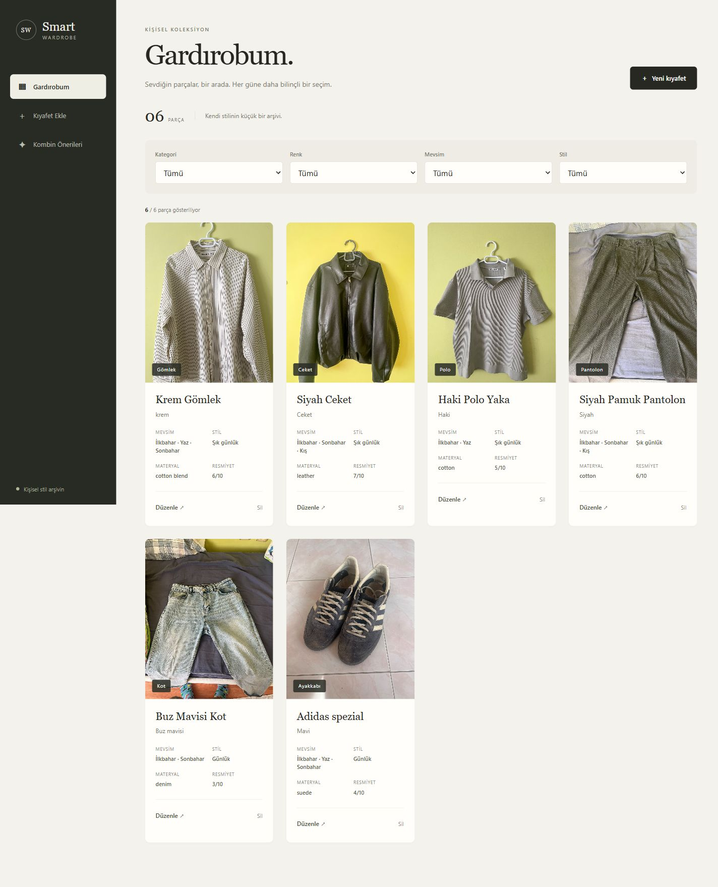
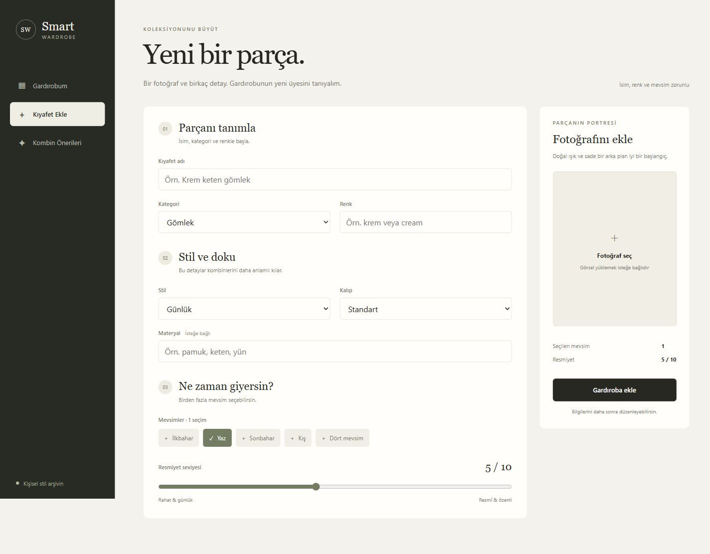
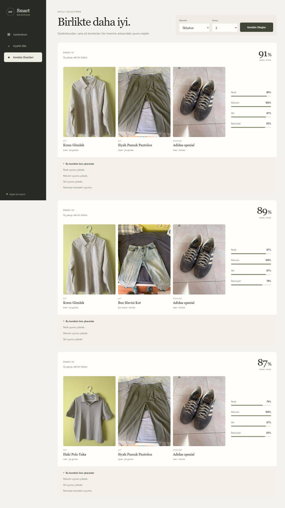

# Smart Wardrobe

## 1. Project Overview

A multi-user wardrobe application with private photo-based clothing management and
deterministic, explainable outfit recommendations. A modular FastAPI API powers a
responsive React dashboard; Supabase Auth provides email/password accounts.
No ML or external weather service is required.

## 2. Features

- Clothing CRUD and partial editing via PATCH; metadata and multiple seasons.
- Email/password registration, email confirmation, login/logout and persistent sessions.
- Verified-token authorization and UUID ownership for CRUD, filters and recommendations.
- Multipart image uploads with UUID filenames; owner folders and authenticated downloads.
- Category, color, season and frontend style filters.
- Ranked outfits with color, season, style and formality scores and explanations.
- Responsive cards, edit/confirmation dialogs, image preview, loading/error/retry states.

## 3. Screenshots

Historical local UI screenshots, using the six original wardrobe items. The current
version adds login/registration; unowned legacy data is preserved but hidden.

### Wardrobe



### Add clothing



### Outfit recommendations



## 4. Architecture

```text
app/
  main.py, auth.py, config.py, database.py, models.py, schemas.py
  routers/     clothes.py, recommendations.py
  services/    clothing_service.py, image_service.py, storage.py, recommendation.py
  migrate.py   explicit production schema bootstrap/additive migrations
frontend/src/
  components/  reusable forms, cards, dialogs and feedback
  pages/       login/register, wardrobe, add clothing, recommendations
  services/    Supabase client, session store, authenticated API client, labels
  types/, styles/
tests/         backend unit and live API smoke tests
docs/          screenshots, quality audit and deployment runbook
```

Routers handle HTTP; services handle storage/business logic. The recommendation
service works on supplied objects without database access. Local SQLite and uploads
share a configurable data directory; defaults remain at the project root. Production
uses PostgreSQL via `DATABASE_URL` and Supabase Storage, independent of Render's disk.
Every protected request verifies its bearer access token with the Supabase Auth API;
the backend never trusts a supplied user ID. Clothing queries are scoped to the
verified UUID. A private bucket and restrictive RLS guards prevent direct client
bypasses. Photos are fetched through an owner-authorized backend endpoint.

## 5. Tech Stack

Backend: Python, FastAPI, Pydantic, SQLAlchemy 2, SQLite/PostgreSQL (psycopg), Uvicorn,
python-multipart and httpx (Supabase Auth/Storage REST). Frontend: React, TypeScript,
Vite, Supabase JS and plain CSS. Tests: Python
unittest, FastAPI TestClient and Node's built-in test runner.

## 6. Recommendation Engine

V2.2 forms one top (`tshirt/shirt/polo/sweater/hoodie`), one bottom
(`pants/jeans/shorts`) and shoes; autumn/winter may include one suitable
`jacket` (also recognizing `coat`). Pairwise color/style/
formality compatibility is averaged. Multiple seasons, `all-season` and legacy
`season` fallback are supported. Missing color/style/formality metadata receives
a neutral fallback; missing season data is penalized.

```text
weighted = color × 0.35 + season × 0.25 + style × 0.25 + formality × 0.15
quality_factor = season_score if a season is requested and season_score < 0.80 else 1
total = clamp((weighted + jacket_bonus) × quality_factor, 0, 1)
GET /recommendations?season=spring&limit=3
```

Scores are bounded to 0–1 and exposed with reasons/penalties. Stable ID tie-breaking
makes repeated requests deterministic. Limit is 1–20 (default 3). Seasons:
spring, summer, autumn/fall, winter, all-season (plus all/any aliases).
Exact season matches score 1; `all-season` scores 0.85; mismatches score 0.10.
The core outfit's color/style/formality calculations and weights are unchanged.
An eligible jacket adds up to 0.05, scaled by its compatibility with the core
pieces; the season quality penalty also applies to that bonus. Jackets are never
added for spring, summer or an unspecified season. One best jacket per core outfit
avoids near-duplicate results. The additive nullable `jacket` response uses the same
clothing serializer, including a `seasons` array. Reasons and penalties identify
the outer layer and unsuitable pieces; details expose `jacket_bonus` and
`season_quality_factor` alongside existing scores.
The frontend renders top → optional jacket → bottom → shoes, with four pieces
on desktop/tablet and a two-by-two layered layout on mobile. Responses without a
jacket retain the original three-piece layout and explanation sections.
Out-of-season pieces are penalized, not excluded. See the historical
[real six-item quality audit](docs/recommendation-quality.md), including the lack
of a summer bottom and cross-request repetition. Fit/material do not affect scores.

## 7. API Endpoints

| Method | Path | Purpose |
| --- | --- | --- |
| GET | `/` | Root/health message |
| GET | `/clothes` | List; optional category/color/season queries |
| POST | `/clothes` | Multipart clothing + optional image |
| GET | `/clothes/{id}` | Retrieve one item |
| PATCH | `/clothes/{id}` | JSON partial metadata update |
| DELETE | `/clothes/{id}` | Delete record and associated image |
| GET | `/recommendations` | Ranked outfits; season/limit queries |
| GET | `/clothes/{id}/image` | Owner-authorized photo download |

All clothing/recommendation routes require `Authorization: Bearer <access_token>`.
Root and Swagger remain public. Missing/invalid/expired tokens return 401; another
user's ID returns 403. Legacy rows with `owner_id=NULL` are hidden and return 404.
Public `/uploads` serving is intentionally removed for privacy.

POST accepts name, category, color, season/seasons, style, fit, material,
formality and image. Repeat the multipart `seasons` field for multiple values.
Responses include nullable legacy metadata and a `seasons` array. List/create
envelopes remain `{clothes: [...]}` and `{message: ..., clothing: {...}}`.
PATCH returns the clothing object directly.

```json
{"style":"smart_casual","formality":6,"seasons":["spring","summer"]}
```

PATCH preserves omitted fields and `image_path`. Updating seasons synchronizes
legacy season to the first value. Formality outside 1–10 returns 422; missing IDs
return 404. Swagger: <http://127.0.0.1:8001/docs>.

## 8. Local Development

Python 3.13 and Node 24 are the tested runtimes. Reuse an existing virtual environment
if available; activation is not required on Windows. For a new checkout:

```powershell
python -m venv .venv
.\.venv\Scripts\python.exe -m pip install -r requirements.txt
.\.venv\Scripts\python.exe -m uvicorn app.main:app --reload --port 8001
```

In this checkout the existing interpreter is `..\.venv\Scripts\python.exe`.
With an active environment, the equivalent start command is
`python -m uvicorn app.main:app --reload --port 8001`. In another terminal:

```sh
cd frontend
npm install
npm run dev
```

Frontend: <http://127.0.0.1:5173>. Backend: <http://127.0.0.1:8001>.
For lockfile-based installation, use `pnpm install --frozen-lockfile` instead.
Copy `frontend/.env.example` to an ignored `frontend/.env.local` and set
`VITE_API_BASE_URL`, `VITE_SUPABASE_URL`, and `VITE_SUPABASE_PUBLISHABLE_KEY`
(public build-time settings). Use the publishable `sb_publishable_...` key only.
Backend `.env.example` documents `FRONTEND_ORIGINS` and `WARDROBE_DATA_DIR`;
export these in the shell/hosting dashboard (backend does not auto-load .env files).
SQLite/local uploads remain the development persistence defaults, but real login
requires Supabase Auth: configure server-only `SUPABASE_URL` and
`SUPABASE_SECRET_KEY` even with `IMAGE_STORAGE=local`. No development auth bypass
is included. Add `http://127.0.0.1:5173/` to Supabase Auth redirect URLs.
The database stores `uploads/<owner>/<uuid>.<ext>` locally or `<owner>/<uuid>.<ext>`
in Supabase mode. API `image_path` is `clothes/<id>/image`, not a public storage URL;
the React client fetches it with a token and revokes its Blob URL when unmounted.

### Deployment

`render.yaml` supplies the backend migration/start/build/health configuration;
`netlify.toml` supplies the frontend build/publish configuration and production
API/Auth config guard. Set the real HTTPS API URL, frontend CORS origin and
Supabase publishable key before deploying. **Before the auth cutover**, run
[the repeatable RLS/ownership SQL](docs/supabase-multi-user.sql), make the bucket
private and configure Auth redirect URLs. Deployment fails closed if production
privacy guards are missing. See [auth setup/cutover](docs/authentication.md) and
[persistence configuration](docs/deployment.md).

Local DB/uploads are deliberately excluded from Git. A fresh cloud deployment is
empty. Production requires PostgreSQL + Supabase Storage; missing settings cause an
explicit startup error, never fallback to ephemeral local storage. Backups are still
necessary. The six local records/photos are not automatically transferred or
claimed by the next person who logs in. Existing unowned rows/photos are retained;
any administrative ownership assignment and legacy image relocation needs a
separate, backed-up, explicit migration.

## 9. Testing

```powershell
..\.venv\Scripts\python.exe -m pip install -r requirements-dev.txt
..\.venv\Scripts\python.exe -m tests
# Optional local live smoke, with your own valid token in WARDROBE_TEST_ACCESS_TOKEN:
..\.venv\Scripts\python.exe tests/smoke_live.py
```

```sh
cd frontend
npm test
npm run build
```

The test runner isolates all unittest tests in disposable storage, even if cloud
credentials exist in the shell. Persistence tests exercise CRUD/PATCH/recommendation
responses with mocked Supabase HTTP plus PostgreSQL config/DDL; live cloud setup
and redeploy checks remain manual. Two-user security tests exercise real routes and
the actual token-verification function against a mock Auth API, covering foreign
CRUD/photo IDs, forged ownership, legacy data, filtered lists and recommendations.
Frontend tests cover session restoration, email confirmation, login/logout,
refresh/401 handling, protected UI and account-switch races.
PATCH tests use in-memory SQLite; deployment tests use temporary storage.
Live smoke creates/cleans temporary records/photos and compares persistent rows,
schema and image hashes. UI verification covers add/edit/delete, recommendations,
loading/error/retry, and 390/768/1024/1440px layouts.

## 10. Roadmap

- More precise per-piece explanations and recommendation diversity.
- Upload size/content hardening and repeatable browser accessibility tests.
- Pagination and scalable combination ranking for larger wardrobes.
- Automated live multi-user/redeploy QA, backups and versioned schema migrations.
- Rate limiting, stronger upload validation and operational observability.

This is a portfolio application with application-level user isolation, not a
substitute for production monitoring, recovery procedures or an independent audit.
